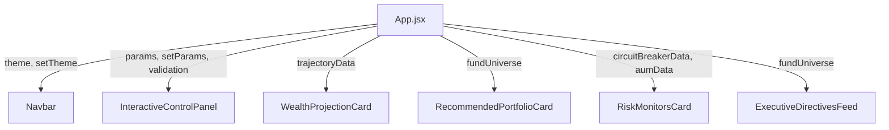

# Design Document: InvestPro Professional Redesign

## Overview

This redesign transforms InvestPro's frontend from a prototype with informal copy, hardcoded values, and decorative animations into a professional-grade fintech product. The backend API, calculation logic, and all existing features remain unchanged. The work is purely presentational: replacing a bespoke visual language with a disciplined design token system, rewriting component markup, cleaning copy, and surfacing the AUM Bloat Scanner which currently has no UI at all.

The design targets the aesthetic of Zerodha/INDmoney: high data density, neutral palette, calm typography, and data-first layouts. The single interactive accent color is `#2563EB` (blue-600).

---

## Architecture

The frontend is a Vite + React SPA. There is no routing — all components live on a single page rendered by `App.jsx`. The data flow is:

```
App.jsx  ──(params)──►  POST /api/v1/user/trajectory-analysis  ──►  trajectoryData state
         ──(params)──►  POST /api/v1/funds/barbell-universe      ──►  fundUniverse state
```

All components receive data as props. No component fetches its own data. This architecture stays completely intact — only the JSX markup and CSS change.



---

## Components and Interfaces

### Design Token System (`index.css` + `index.html` Tailwind config)

**CSS custom properties** defined on `:root` (dark) and `html.light` (light):

| Token | Dark value | Light value |
|---|---|---|
| `--color-bg` | `#020617` | `#f8fafc` |
| `--color-surface` | `#0f172a` | `#ffffff` |
| `--color-surface-raised` | `#1e293b` | `#f1f5f9` |
| `--color-border` | `#1e293b` | `#e2e8f0` |
| `--color-text-primary` | `#f1f5f9` | `#0f172a` |
| `--color-text-muted` | `#94a3b8` | `#64748b` |
| `--color-accent` | `#2563eb` | `#2563eb` |
| `--color-success` | `#16a34a` | `#16a34a` |
| `--color-warning` | `#d97706` | `#d97706` |
| `--color-danger` | `#dc2626` | `#dc2626` |

**Tailwind utility mappings** in `index.html` `tailwind.config`:

```js
colors: {
  surface: 'var(--color-surface)',
  'surface-raised': 'var(--color-surface-raised)',
  border: 'var(--color-border)',
  muted: 'var(--color-text-muted)',
  accent: 'var(--color-accent)',
  success: 'var(--color-success)',
  warning: 'var(--color-warning)',
  danger: 'var(--color-danger)',
}
```

**Removed from `index.css`:**
- `body { background-image: radial-gradient(...), linear-gradient(...) }` — grid pattern and overlay
- `body.light { background-image: ... }` — light grid pattern
- `@keyframes floatUp` and `.animate-float-up`
- `@keyframes alarmFlash` and `.animate-alarm-flash`
- Cyan-glow scrollbar thumb (`rgba(0, 240, 255, ...)`)

**Retained in `index.css`:**
- `@keyframes spinSlow` and `.spin-slow`
- Range slider thumb and track styling (thumb color changes from cyan to accent `#2563EB`)
- `transition-colors` base behavior

### Navbar

Props: `{ theme: string, onToggleTheme: () => void }`

Structure:
```
<header class="sticky top-0 z-50 h-14 border-b border-border bg-surface/90 backdrop-blur-sm">
  <div class="max-w-7xl mx-auto px-4 h-full flex items-center justify-between">
    <div>  <!-- wordmark -->
      <span>InvestPro</span>
      <span class="text-sm text-muted">Investment Planner</span>
    </div>
    <button>  <!-- icon-only toggle -->
      {theme === 'dark' ? <Sun /> : <Moon />}
    </button>
  </div>
</header>
```

**Removed:** ShieldCheck icon, gradient border, version badge, AMFI badge, Groww link.

### InteractiveControlPanel (renamed: Portfolio Parameters)

Props: `{ params, setParams, onRecalculate, loading, validation }`

Key changes:
- Heading: "Portfolio Parameters"
- All inputs use the unified style class: `bg-surface-raised border border-border rounded-md px-3 py-2 focus:outline-none focus:ring-2 focus:ring-accent`
- Labels: sentence-case, Outfit font, no icons with per-field accent colors
- ₹50L / ₹1 Cr / ₹3 Cr appear as `<button type="button" class="text-xs text-accent">` links inline under the corpus input
- "Age 30 Target (April 2035)" option removed from time horizon select
- `dob` default: empty string `""`
- Recalculate button: `bg-accent text-white rounded-md px-4 py-2 text-sm font-medium`
- No gradient stripe at top, no `hover:-translate-y-1` on field containers

### GhostTrajectoryCard (renamed: WealthProjectionCard)

Props: `{ trajectoryData }`

Key changes:
- Heading: "Wealth Projection"
- On-track badge: plain text "On Track", no emoji, no `animate-bounce`
- Floating ₹ rain overlay: removed entirely
- Status banner: `rounded-lg p-4` block; message rendered as `text-sm` prose
- Off-track message format: "Market returns alone cannot close this gap. To reach {target} by {year}, your monthly SIP needs to be {needed_sip}, which requires a CTC of approximately {needed_ctc} LPA."
- Purchasing Power section heading: "Purchasing Power Analysis"
- Segmented bar: replaces animated pulse bar — one bar with three segments (accent/muted/danger) sized by `realPowerPct`, `inflationLossPct`, `taxPct`
- Chart: `stroke="#2563EB"`, fill gradient from `rgba(37,99,235,0.25)` to transparent; axis/tooltip use token colors
- Career roadmap table headers: `text-xs text-muted uppercase`; removed per-row "TARGET HIT" badge

### BarbellPortfolioCard (renamed: RecommendedPortfolioCard)

Props: `{ fundUniverse }`

Key changes:
- Heading: "Recommended Portfolio"
- Strategy pill: `<span class="text-xs border border-border rounded-full px-2 py-0.5 text-muted">` showing human-readable strategy name
- Bucket tag per row: `<span class="text-xs text-muted">{item.bucket}</span>` adjacent to fund name
- Risk badge colors: Very High/High → `text-danger`, Moderate-High → `text-warning`, Low/Low-Moderate → `text-success`
- Returns: plain `font-mono text-sm` with `text-xs text-muted` labels, no colored wrappers
- Groww link: `<a class="text-accent text-xs inline-flex items-center gap-1">Groww <ExternalLink /></a>` inline in row
- Summary: `<div class="border-t pt-4 flex justify-between">` with Portfolio CAGR and Total Annual Growth
- Removed: Sparkles icons, gradient summary box, allocation weight badge pills

### CircuitBreakerCard + AUM Section (renamed: RiskMonitorsCard)

Props: `{ circuitData, aumData }`

**SMA section:**
```
<div>  <!-- SMA stat tiles -->
  <div class="grid grid-cols-2 gap-4">
    <Tile label="SMA 50" value={sma50} fontMono />
    <Tile label="SMA 200" value={sma200} fontMono />
  </div>
  <StatusLine dot={isbullish ? 'green' : 'red'} text={isbullish ? 'Bullish — SMA 50 above SMA 200' : 'Bearish — SMA 50 below SMA 200'} />
  <p class="text-sm text-muted">  <!-- explanation prose --> </p>
  <p class="text-xs text-muted italic">SMA values are indicative. Computed from daily AMFI NAV data.</p>
</div>
```

Removed: crash simulation button, `isCrashSimulated` state, `animate-alarm-flash`, "DEATH CROSS DETECTED!" banner, Flame icon.

**AUM Bloat Monitor section (NEW):**
```
<div class="border-t mt-4 pt-4">
  <h4>AUM Bloat Monitor</h4>
  <p class="text-sm text-muted">Small-cap and momentum funds lose agility above ₹10,000 Crore AUM.</p>
  {aumData.map(fund =>
    <div class="flex items-center justify-between py-2">
      <span>{fund.scheme_name}</span>
      <StatusPill status={fund.status} />  <!-- green HEALTHY / amber WARNING / red BLOATED -->
      <span class="font-mono text-sm">₹{fund.current_aum_crores} Cr</span>
    </div>
  )}
  <p class="text-xs text-muted italic">AUM data updated via daily pipeline.</p>
</div>
```

### DirectivesFeed (renamed: ExecutionDirectivesFeed)

Props: `{ fundUniverse }`

Key changes:
- Heading: "Execution Directives"
- Rows derived from `fundUniverse.asset_breakdown` — one row per fund, all BUY directives
- Row layout: `divide-y divide-border`, no nested card wrappers
- Each row: `[BUY badge] Fund name  [allocated_sip font-mono]  [Groww link text-accent text-xs]`
- Placeholder note: "PAUSE SIP directives appear here when the circuit breaker triggers a momentum breakdown."
- Telegram button: `<button class="text-xs text-muted underline">`
- Null state: `<p class="text-sm text-muted">Configure your portfolio to see directives.</p>`

### App.jsx

Key changes:
- Theme init: read from `localStorage` on mount, single toggle handler updates state + localStorage + `document.documentElement.classList`
- Pass `fundUniverse` as prop to `ExecutionDirectivesFeed`
- Loading skeleton: 3 blocks with `rounded-lg bg-surface-raised animate-pulse` at `h-[400px]`, `h-[300px]`, `h-[200px]`
- Remove `hover:-translate-y-1` from all card wrappers in the grid
- Remove `dob: "2005-04-14"` and `far_target_date: "2035-04-14"` from initial params state

---

## Data Models

No data model changes. All interfaces are defined by the existing backend API responses:

**TrajectoryData** (from `POST /api/v1/user/trajectory-analysis`):
```ts
{
  short_term_target: {
    verdict: 'ON_TRACK' | 'CAREER_LEVERAGE_REQUIRED',
    message: string,
    formatted_target: string,
    formatted_projected: string,
    formatted_post_tax: string,
    formatted_real_power: string,
    purchasing_power_note: string,
    projected_short_fv: number,
    total_contributions: number,
    ltcg_tax: number,
    real_purchasing_power_today: number,
    months_remaining: number,
    years_remaining: number,
    career_leverage_needed: boolean,
    formatted_needed_sip?: string,
    needed_ctc_annual_lpa?: number,
    formatted_needed_ctc?: string,
  },
  career_roadmap_to_3cr: CareerMilestone[]
}
```

**FundUniverse** (from `POST /api/v1/funds/barbell-universe`):
```ts
{
  risk_mode: 'aggressive' | 'ultra_aggressive' | 'balanced',
  total_monthly_sip: number,
  total_lump_sum: number,
  portfolio_weighted_5y_cagr: number,
  formatted_total_annual_growth: string,
  asset_breakdown: AssetItem[]
}

AssetItem: {
  fund_name: string,
  bucket: 'Anchor' | 'Accelerator' | 'Debt Shield' | 'Hedge',
  allocation_pct: number,
  allocated_sip: number,
  formatted_sip: string,
  groww_url: string,
  risk_level: 'Very High' | 'High' | 'Moderate-High' | 'Moderate' | 'Low-Moderate' | 'Low',
  returns: { cagr_3y: number, cagr_5y: number, cagr_all_time: number },
  goal_impact_role: string,
  formatted_growth_contribution: string,
}
```

**AUM data** is expected from `GET /api/v1/risk/aum-bloat` (to be wired up):
```ts
BloatCheckResult[]: {
  scheme_name: string,
  current_aum_crores: number,
  aum_threshold_crores: number,
  status: 'HEALTHY' | 'WARNING' | 'BLOATED',
  recommendation?: string
}
```

**Circuit breaker data** is expected from `GET /api/v1/risk/circuit-breaker` (to be wired up):
```ts
SMACrossoverResult[]: {
  scheme_name: string,
  sma_50: number,
  sma_200: number,
  signal: 'DEATH_CROSS' | 'GOLDEN_CROSS' | 'NEUTRAL',
}
```

---

## Correctness Properties

*A property is a characteristic or behavior that should hold true across all valid executions of a system — essentially, a formal statement about what the system should do. Properties serve as the bridge between human-readable specifications and machine-verifiable correctness guarantees.*

The frontend components in this redesign have several universal properties worth verifying with property-based tests. The components are pure render functions of their props, making them ideal for PBT.

### Property 1: On-track banner contains no emoji or animation markers

*For any* `trajectoryData` object where `short_term_target.verdict === 'ON_TRACK'`, the rendered `WealthProjectionCard` output should not contain the strings "PAISA UDDE", "🎉", animate-bounce class references, or any `animate-float-up` elements.

**Validates: Requirements 5.2, 5.12**

---

### Property 2: Backend message string is always rendered as visible text

*For any* non-empty `message` string in `short_term_target`, the rendered `WealthProjectionCard` should contain that message string in its text content without truncation or transformation.

**Validates: Requirements 5.3**

---

### Property 3: Strategy pill reflects risk_mode for all valid inputs

*For any* `fundUniverse` with a `risk_mode` in `{ 'aggressive', 'ultra_aggressive', 'balanced' }`, the rendered `RecommendedPortfolioCard` should display a non-empty strategy label pill whose text is derived from that `risk_mode`.

**Validates: Requirements 6.2**

---

### Property 4: Every asset in asset_breakdown has its bucket label rendered

*For any* `fundUniverse.asset_breakdown` array of N items, the rendered `RecommendedPortfolioCard` should contain each item's `bucket` value as visible text, and should render exactly N fund rows.

**Validates: Requirements 6.3, 9.3**

---

### Property 5: Risk badge color is consistent with risk_level for all inputs

*For any* asset with `risk_level` in `{ 'Very High', 'High', 'Moderate-High', 'Low-Moderate', 'Low' }`, the rendered risk badge in `RecommendedPortfolioCard` should apply a color class consistent with the specification: danger for Very High/High, warning for Moderate-High, success for Low/Low-Moderate.

**Validates: Requirements 6.4**

---

### Property 6: SMA status label is determined solely by numeric comparison

*For any* pair of positive numbers `(sma50, sma200)`, the `RiskMonitorsCard` SMA status label should be "Bullish — SMA 50 above SMA 200" if and only if `sma50 > sma200`, and "Bearish — SMA 50 below SMA 200" if and only if `sma50 < sma200`.

**Validates: Requirements 7.3, 7.4**

---

### Property 7: AUM status pill color matches status value

*For any* AUM fund entry with `status` in `{ 'HEALTHY', 'WARNING', 'BLOATED' }`, the rendered status pill in the AUM Bloat Monitor section should apply the correct color class: success-colored for HEALTHY, warning-colored for WARNING, danger-colored for BLOATED.

**Validates: Requirements 8.3**

---

### Property 8: Directive rows match asset_breakdown length

*For any* `fundUniverse` with an `asset_breakdown` array of length N (N ≥ 1), the rendered `ExecutionDirectivesFeed` should display exactly N directive rows.

**Validates: Requirements 9.3**

---

## Error Handling

**API failures**: The existing `ErrorBoundary` in `App.jsx` is retained. If `trajectoryData` or `fundUniverse` is null (failed fetch), components render gracefully with skeleton or placeholder states rather than throwing.

**AUM/circuit-breaker data unavailable**: `RiskMonitorsCard` renders with a `text-sm text-muted` placeholder if data is null.

**null fundUniverse**: `ExecutionDirectivesFeed` renders a `text-sm text-muted` placeholder string.

**Theme localStorage failure**: The theme init script in `index.html` is already wrapped in a `try/catch`. This is retained.

---

## Testing Strategy

This feature involves React component redesign — UI rendering logic with conditional display, data-derived output, and state management. Property-based testing is appropriate for the universal properties defined above (components are pure functions of their props). Unit/example tests cover specific rendering scenarios and state transitions.

**Library**: [fast-check](https://github.com/dubzzz/fast-check) for JavaScript/React PBT. Tests use [React Testing Library](https://testing-library.com/docs/react-testing-library/intro/) for rendering.

**Unit tests** (example-based) cover:
- Theme toggle handler: dark → light and light → dark transitions
- Validation card states: exactly 0, 1, 2, 3, 4 fields filled
- Career leverage off-track message format with fixture data
- Null/empty prop handling for all redesigned components

**Property tests** (fast-check, minimum 100 runs each):

Each property test is tagged with the design property it validates.

```
Feature: investpro-professional-redesign, Property 1: on-track banner contains no emoji or animation markers
Feature: investpro-professional-redesign, Property 2: backend message string is always rendered as visible text
Feature: investpro-professional-redesign, Property 3: strategy pill reflects risk_mode for all valid inputs
Feature: investpro-professional-redesign, Property 4: every asset in asset_breakdown has its bucket label rendered
Feature: investpro-professional-redesign, Property 5: risk badge color is consistent with risk_level for all inputs
Feature: investpro-professional-redesign, Property 6: SMA status label is determined solely by numeric comparison
Feature: investpro-professional-redesign, Property 7: AUM status pill color matches status value
Feature: investpro-professional-redesign, Property 8: directive rows match asset_breakdown length
```

**Integration tests** cover:
- Theme toggle: localStorage value matches document class after toggle
- Skeleton loading: correct number and approximate size of skeleton blocks rendered when `loading === true`

**Not tested via PBT** (infrastructure/config checks):
- CSS token values — verified by snapshot test of computed styles
- Tailwind config mappings — verified by smoke test / visual inspection
- `index.html` title change — verified by example test
