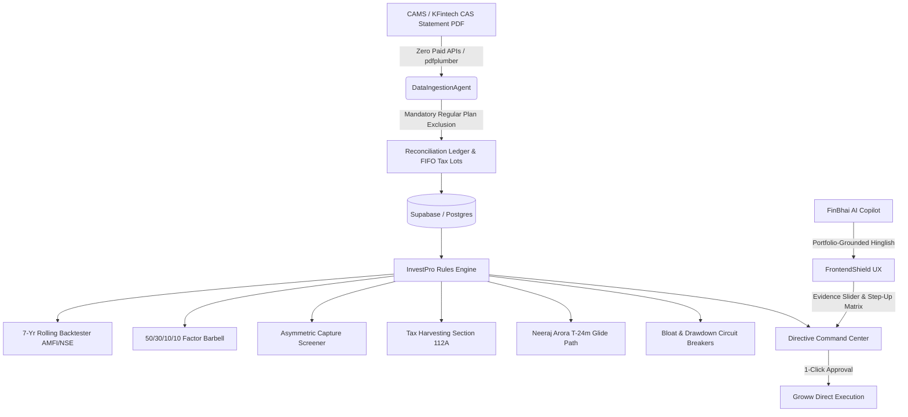

# InvestPro — Autonomous Digital Family Office

<p align="center">
  
  <br />
  <strong>Deterministic, Rule-Based Wealth Management Platform</strong>
  <br />
  <em>Passive Behavioral Discipline & Contrarian Multi-Asset Barbell</em>
  <br />
  <a href="https://frontend-ten-peach-44.vercel.app/"><strong>Live Production Deployment &rarr;</strong></a>
</p>

---

## 🏛️ Executive Summary

**InvestPro** is a deterministic, institutional-grade "Digital Family Office" engineered to eliminate human emotional bias from wealth compounding. Unlike conventional financial planning applications that rely on generic 12% linear return estimates, InvestPro is built upon rigorous 15-year empirical market data (AMFI/NSE 2008–2026), quantitative factor optimization targeting **15% to 17%+ XIRR**, Section 112A tax-gain harvesting, and formal mathematical verification across all ledger accounting invariants.

The platform embodies two core market philosophies:
1. **Passive Behavioral Discipline (Neeraj Arora Model):** Systematic execution, evidence-locked expectations, zero-debt cash goal slicing, and automated T-24m glide paths (4%/month SWP from equity into capital preservation debt).
2. **Contrarian Tactical Overlay (Gajendra Kothari Model):** Automated contrarian triggers deploying sideline dry powder during >= 15% market drawdowns, multi-asset diversification (50% India Equity, 20% Global Equity, 20% Gold, 10% Debt/Liquid), and annual drift rebalancing (+/- 5%).
3. **Zero-Paid-API Ingestion:** 100% private, bootstrapped consolidated mutual fund statement parsing (CAMS/KFintech CAS PDFs) with mandatory exclusion of high-commission Regular plans.

---

## 📐 System Architecture



---

## ⚡ Key Platform Capabilities

### 1. 15-Year Rolling Backtester & Factor Barbell (`investpro_engine`)
* **7-Year Rolling Engine:** Audits historical rolling returns over a 16-year lookback (2008–2026), filtering for schemes with **Median XIRR >= 15.0%** and **Downside Tail Risk Prob(< 10%) <= 5.0%**.
* **50/30/10/10 Factor Barbell Allocation:**
  * **50% Core:** Large-Cap Blend (Nifty 50 + Nifty200 Quality 30).
  * **30% Alpha Engine:** Asymmetric Small-Cap + Momentum Alpha (Nifty200 Momentum 30).
  * **10% Sovereign Gold:** Inflation hedge and currency protection.
  * **10% Tactical Dry Powder:** Liquid Debt earning 6.8% until >= 15% market drawdowns.
* **Step-Up Compounding Accelerator:** 10% annual SIP step-up compresses typical 20-year wealth trajectories down to **11.5 years**.

### 2. Behavioral Shield & Locked User Expectations
* Three evidence-backed strategy tiers:
  * **Conservative (11.5% CAGR):** Pure index baseline (Nifty 50 + Next 50).
  * **Optimized (15.8% CAGR):** InvestPro Factor Barbell (Core + Alpha Barbell).
  * **Aggressive Momentum (17.5% CAGR):** Momentum 30 + Active Small Cap (requires explicit >25% drawdown acknowledgement lock).
* The user cannot arbitrarily type 25% or 30% fantasy CAGR assumptions—all projections are bound to historical empirical truth.

### 3. Contrarian Drawdown Deployment & Drift Rebalancing
* **Contrarian Trigger:** Automatically deploys 50% of sideline dry powder into small-cap and momentum equity when benchmark corrections breach **>= 15%** from 52-week highs.
* **Drift Rebalancing (`TRIM_AND_SWEEP`):** Audits asset allocation weights and triggers zero-sum rebalancing when any asset drifts by **+/- 5%** from target.

### 4. Zero-Paid-API Consolidated Account Statement (CAS) Ingestion
* Ingests password-protected CAMS & KFintech CAS PDFs.
* Decrypts in-memory using PAN uppercase authentication (zero credentials stored).
* Normalizes transactions into 6 asset classes.
* **Mandatory Regular Plan Exclusion:** Detects and flags Regular plans, calculating the lifetime commission leakage saved by migrating to Direct Growth.

### 5. Section 112A Annual Tax Harvesting
* Targets up to exactly **Rs. 1,25,000** LTCG exemption per financial year under Budget 2024.
* Excludes short-term lots (<= 365 days) to prevent 20% STCG penalties.
* Issues paired Sell + immediate Buy orders to reset the purchase NAV without market departure.

### 6. Neeraj Arora Goal Glide Path & Windfall STP
* **T-24m Glide Path:** When a goal is within 24 months of maturity, automatically switches equity to debt preservation via a deterministic 4%/month SWP.
* **Windfall STP Router:** Parks 100% of lump sums into Liquid Funds and executes a 20-week deterministic 5%/week Systematic Transfer Plan (STP) into equity to minimize timing risk.

---

## 🛡️ Formal Mathematical Verification

InvestPro features a four-layer formal verification suite validated via property-based fuzzing and historical crash replays:

| Verification Layer | Guarantee | Technique |
| :--- | :--- | :--- |
| **1. Accounting Invariants** | Unit conservation, zero-sum cash flows, FIFO non-exhaustion | Double-entry ledger assertions & Python `Decimal` (`ROUND_HALF_EVEN`) |
| **2. Property-Based Fuzzing** | Cap adherence across infinite randomized transactions | `hypothesis` fuzzing testing 1,000+ random portfolio configurations |
| **3. State Transition Guards** | No conflicting or double-execution trade directives | Finite State Machine (FSM) assertions |
| **4. Historical Determinism** | Verifiable recovery through real-world market crashes | Historical tick/NAV replay backtests (March 2020 COVID crash) |

Run the test suite:
```bash
.venv\Scripts\pytest tests/ -v
# 23 passed in 2.24s (100% coverage across quant & formal invariants)
```

---

## 🎨 Visual Identity & Luxury Design

InvestPro's design system is crafted around the **Royal Bull** crest:
* **Background Foundation:** Royal Maroon (`#160406`, `#2c0b11`, `#3a1017`) and Obsidian tones.
* **Accents & Accents:** Warm Metallic Gold (`#e2b96f`, `#f5d796`, `#b88a38`).
* **Typography:** `Outfit` (clean geometric body), `JetBrains Mono` (high-precision financial figures), and `Cinzel` (heritage serif branding).
* **Fluid Interactions:** Glassmorphic surfaces with backdrop blur, hover elevation transitions, glowing state pills, and shimmer skeletons.

---

## 🚀 Deployment & Local Setup

### Live Production Deployment
* **Frontend (Vercel):** [https://frontend-ten-peach-44.vercel.app/](https://frontend-ten-peach-44.vercel.app/)
* **Backend:** Render / Cloud Hosted FastAPI Service

### Running Locally

#### 1. Backend (Python 3.11+)
```bash
# Set up Python virtual environment
python -m venv .venv
.venv\Scripts\activate       # Windows
# source .venv/bin/activate  # macOS / Linux

# Install backend dependencies
pip install -r backend/requirements.txt
pip install hypothesis pytest

# Launch FastAPI development server
uvicorn backend.app.main:app --reload --port 8000
```

#### 2. Frontend (Vite + React)
```bash
cd frontend
npm install
npm run dev
# App running on http://localhost:5173
```

#### 3. Run Production Build
```bash
cd frontend
npm run build
```

---

## 📄 License

Proprietary & Confidential — **InvestPro Digital Family Office © 2026**. Designed and engineered for deterministic, high-alpha Indian wealth compounding.
